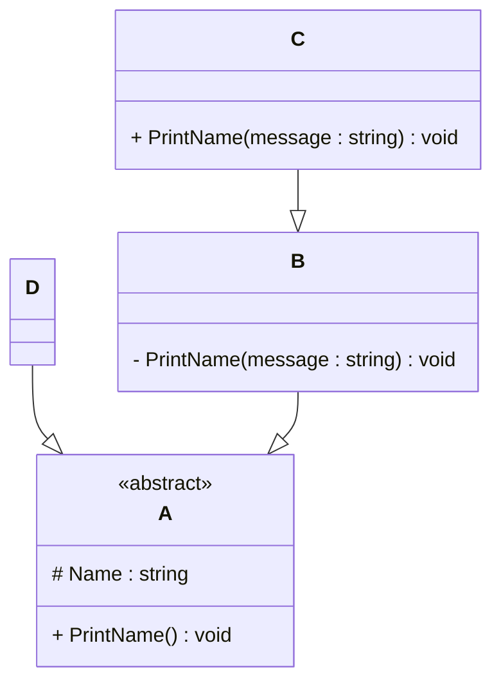

# Programming Test

This test was composed to create a general overview of your knowledge regarding general programming and how it fits with the needs in our lab. Please try to answer all questions using your own knowledge and in your own words. If you get stuck on one of the exercises, still try to give a short answer.

---

## Exercise 1

### Task
Write a program in the language of your choice where:

1. The iteration number (starting from 1), followed by a random number between 1 and 100, is printed 100 times.
2. After every 5 iterations, write an additional separator (e.g., `---`).
3. Write “Lucky number!” after every random number that is divisible by 7.

> Try to keep the procedure as short as possible.
```
class Program
{
    static void Main()
    {
        var rnd = new Random();
        for (int i = 1; i <= 100; i++)
        {
            int num = rnd.Next(1, 101);
            Console.WriteLine($"{i}: {num}" + (num % 7 == 0 ? " - Lucky number!" : ""));
            if (i % 5 == 0) Console.WriteLine("---");
        }
    }
}
```
---

## Exercise 2

### 1. **What is your understanding of the term “Design Patterns”?**  
   Provide a description in your own words.
   > Design patterns provides us with resuable solutions to common problems that developers face when designing and building software. They also define best practices that help structure code logically and consistently, often leading to more understandable, maintainable and flexible systems.

### 2. **Explain the MVC Pattern**  
   - What does MVC stand for?
   
   >The MVC stands for Model-View-Controller. It is a design pattern which is used to organize code in a project so that everything is neatly separated by role. It helps developers manage large applications better.
   
   - Explain the pattern in detail.
   >
      - Model: Manages the data and business logic, a defined relational structure of connected database. It also contains logic/functions  to perfom CRUD (Create, Reead, Update & Delete) operations on database.
      - View: Handles how the data is displayed to the user.(also User Interface). It doesn’t interact directly with the model—usually and  does this through the controller.
      - Controller: Responds to user input and interacts with the model and view. Updates the view based on model changes.

   - What are some use cases for this framework?
   ```
   MVC pattern is widely used in web and desktop application development where the application is being updated frequently based on user interactions. This pattern helps developers to work on different aspects of applications (e.g. frontend and backend)
   Creating a basic application to perform CRUD operations on a database.
   ```

### 3. **List three other design patterns**  
   - Provide names and details for three additional design patterns.
   - Explain how you have used those patterns in the past and how they have solved your problem  
   - Use diagrams to explain the design patterns.
   #### a) **Singelton pattern**
   ```
   This pattern ensures that a class has only one instance and provides a global point of access to that instance.

   We utilised this pattern to:
      -  initialize the test procedure with connection to linux test system, logging and setting environment valriables.
      -  define a single global connection to the linux system and define basic functions like [PressXY,PressID, GetActiveWindow,etc] that we were developing automated test for.
      -  contain logs and generate a single log file.
      -  store different button ID's and screen ID's which were available on the test linux system's UI, so that it can be used just by accesing the variables which contained the ID of objects on UI.
      -  windows regex is also a great example of singleton design, we used to utlize this to keep track to device configuration of test station.
   
   Basic Design:
   +------------------+
   |   Singleton     |       (1) Global Access
   +------------------+<-----------------+
   | - instance      |                   |
   +------------------+                  |
   | + getInstance() |                   |
   +------------------+                  |
         |                               |
         v                               |
   +------------------+                  |
   |  Client         |-------------------+
   +------------------+
   ```
   #### b) **Adapter pattern**
   ```
   Converts one interface to another interface, or, it allows incompatible interfaces to work together. It acts as a bridge between two incompatible interfaces by converting the interface of a class into another interface that a client expects.

   Since, the test application and framework was based on C#, we utlized this pattern to:
      - communicate with our linux based test system.
      - communicate with a connected embedded system which generate pulse values.
   

   Basic design:
     +----------------------------+
     |      Client (Program)      |
     |  (Wants to run Linux cmd)  |
     +----------------------------+
                   |
                   v
     +-----------------------------+
     | Target Interface            |
     | ILinuxCommandExecutor       | <--------------------+
     +-----------------------------+                      |
                   ^                                      |
                   |                                      |
     +-----------------------------+        adapts        |
     | Adapter                     | ---------------------+
     | LinuxCommandAdapter         |                      
     +-----------------------------+                      
                   |                                     
                   v
     +-----------------------------+
     | Adaptee (Incompatible class)|
     | SshClient                   |
     | (Executes actual SSH calls)|
     +-----------------------------+
   ```
   #### c) **Observer pattern**
   ```
   This pattern is used when a objects state changes and all dependent objects needs to be notified automatically.

   We utlised this pattern to:
      -  update the test framework about the state change of our linux test device.
      - if changes are not updated then repeat certain steps else proceed to next step.
      - log the information about change in test system state.
   Basic structure:
+------------------------+
| LinuxDeviceConnection  |  <-- Subject
+------------------------+
| + Attach(observer)     |
| + Detach(observer)     |
| + NotifyObservers()    |------------
+------------------------+           |  
            |                        |
            | Notifies               | Notifies
            ↓                        ↓
+--------------------+     +-----------------+
|      Logger        |     | ProceedNextStep |
+--------------------+     +-----------------+
| OnDataReceived()   |     | OnDataReceived()|
+--------------------+     +-----------------+

```
---

## Exercise 3

### 1. **Implementation Task**  
   Based on the class diagram below, provide an implementation in any object-oriented programming language of your choice.
   

**Implementation**
```
using System;

// Abstract base class A
abstract class A
{
    protected string Name = "Default Name";
    public virtual void PrintName()
    {
        Console.WriteLine("A says: " + Name);
    }
}

// Class B inherits from A
class B : A
{
    private void PrintName(string message)
    {
        Console.WriteLine("B says: " + message);
    }
}

// Class C inherits from B
class C : B
{
    public void PrintName(string message)
    {
        Console.WriteLine("C says: " + message);
    }
}

class D : A
{
    public override void PrintName()
    {
        Console.WriteLine("D says: " + Name);
    }
}
class Program
{
    static void Main()
    {
        A objD = new D();
        objD.PrintName(); // Calls D.PrintName()

        A objA = new B();
        objA.PrintName(); // Calls A.PrintName() since B didn't override it

        C objC = new C();
        objC.PrintName("Hello from C"); // Calls C.PrintName(string)

        // can't do this because PrintName(string) in B is private
        // and is only accessible from inside of class and not it's objects
        // B objB = new B();
        // objB.PrintName("Hello from B"); // Compile error
    }
}


```
Sample output: Initialise all objects and call PrintName() function:
```
D says: Default Name
A says: Default Name
C says: Hello from C
```

### 2. **Key Questions**  
   - Are you able to directly create a new instance of `ObjectA`? Please explain your answer. 
   ```
   We cannot direct create a new instance of `ObjectA` because it is an abstract class and abstract class serves as a template for other classes. It is also incomplete by design (blueprint).
   ```
   - Given an instance of `ObjectC`, are you able to call the method `PrintMessage` defined in `ObjectB`? Please explain your answer.
   ```
   No, since the function is a private function. It can be only accessed from inside of class C.
   ```
   - Try to explain as many key features of object-oriented programming as you can find in this example.
  
      -  **Abstraction** : Hiding internal details and showing only the essential features of an object.
         - Class A is abstract — it defines a general interface (PrintName) but leaves the implementation to derived classes.
         - We can’t instantiate A, which forces subclasses like B, C, and D to define meaningful behavior.
      -  **Inheritance** : One class can inherit the properties and methods of another.
         - B : A → Class B inherits from A.
         - C : B → Class C inherits from B.
         - D : A → Class D inherits from A.
      -  **Polymorphism** : The ability to treat objects of different classes that share a common base class as if they were of the base class type. In below example we are able to create instance of D and B using base class A.
         - A objD = new D();
         - A objA = new B();
         - Also we can use:
         ```
         A[] classes = { new B(), new C(), new D() };
         foreach (var obj in classes)
         {
            obj.PrintName();
         }
         ```
      - **Encapsulation** : Bundling data and methods together, and restricting access to internal details using access modifiers.
         - protected string Name; // in abstract class A
         - private void PrintName(string message); // in class B
         - public void PrintName(string message);  // in class C
      - **Method Overriding** : A subclass provides a specific implementation of a method already defined in its base class.
         - Exapmle usage:
         ```
         public override void PrintName()
         {
            Console.WriteLine("D says: " + Name);
         }
         ```
      - **Method Overloading** : Multiple methods with the same name but different parameter lists.
         - We are not explicitly overloading in a single class, but the methods:
            - PrintName() (in A/D)
            - PrintName(string) (in B/C)
         have same name but different signatures, which is a form of method overloading.
      - **Access Modifiers & Visibility Control** : Control access to class members using keywords like public, private, protected.
      Usage:
         - protected string Name
         - private PrintName(string) in B
         - public PrintName(string) in C
      - **Dynamic dispatch** : The mechanism that decides which method to call at runtime based on the object's actual type.
      Usage:
         ```
         A obj = new D();
         obj.PrintName(); // calls D.PrintName at runtime
         ```
         Even though obj is declared as type A, .NET dispatches the call to the correct overridden method (D.PrintName) at runtime.
---

## Exercise 4

### Maintaining and Expanding Software for Component Validation

This exercise focuses on strategies for working with existing code bases and ensuring the software remains maintainable as new features and requirements are introduced.

### 1. **Working with Existing Code**  
- How would you approach understanding and contributing to an existing code base with minimal disruption? 
```
  - Review documentation and code structure.
  - Identify core modules and their relationships.
  - Use debugging and breakpoints to see code flow.
  - Run tests and examine logs/output.
  - Start with small, non-invasive changes.
  - Seek guidance from team members when needed.
```
- What practices would you follow to ensure your changes integrate well with the current structure?  
```
   - Follow existing coding standards and conventions.
   - Ensure changes are tested, preferably with unit tests.
   - Request code reviews for feedback.
   - Use version control to manage changes and integrate safely.
```

### 2. **Ensuring Maintainability**  
- What techniques would you use to keep the code base clean, modular, and easy to maintain as new features are added? 
```
   - Follow SOLID principles.
   - Use clear naming and modular architecture.
   - Refactor to reduce duplication and complexity.
```
- How would you handle code documentation and testing to support long-term maintainability? 
```
   - Document complex logic and decisions directly in code.
   - Ensure high test coverage with unit and integration tests.
   - Use automated testing.
   - Keep tests updated with code changes.
```

### 3. **Balancing Flexibility and Stability**  
- How would you design or refactor the software to make it flexible for future changes while ensuring the existing functionality remains stable?
```
   - Use separation of concerns and configuration files to make components flexible.
   - Maintain backward compatibility and versioned APIs.
   - Write regression tests to prevent breaking changes.
``` 
- Which design patterns or principles would you apply to achieve this balance
```
   - Apply Strategy, Factory, and Observer patterns for flexibility.
   - Follow SOLID principles for maintainability and extensibility.
   - Use Dependency Injection for decoupling components.
   - Apply CI/CD pipelines for smooth integration.
```
---
